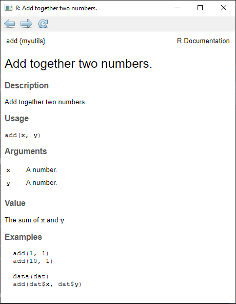

```{r setup, include=FALSE}
#options(htmltools.dir.version = FALSE)
knitr::opts_chunk$set(message = FALSE, warning = TRUE, cache = FALSE, eval = FALSE,  
                      error = TRUE, dev = "cairo_pdf", fig.retina = 2)

library(devtools)
library(usethis)
library(roxygen2)
library(testthat)
```

```{r xaringan-themer, include=FALSE, warning=FALSE}
library(xaringanthemer)
#?style_mono_accent

style_mono_accent(
  base_color = "#1c5253", 
  inverse_text_color = "#cbf7ed",
  link_color = "orange"
)

# style_mono_accent_inverse(
#   link_color = "orange"
# )

style_extra_css(
  css = list(
    ".inverse h4" = list(color = "orange"),
    ".title-slide h1" = list(color = "orange")
  ))
```

class: inverse
# Workshop Description

#### Why make an R package? 

So many reasons! From sharing code and collaboration, to reproducibility and regulatory concerns, and finally for organizing your own analysis projects and tidy coding practices, R packages are here to help!

[...]

#### Requirements:
This workshop requires some experience with R and is targeted at beginner to intermediate R users

---
class: inverse
# Workshop Description (cont.)

#### Contents

In this workshop, we will cover the very first steps of R package creation, the basic R package structure as well as all relevant components. 

-	Start to write R functions, 
-	document them with help pages, 
-	integrate examples and data, 
-	make sure that your code does what is expected by implementing unit testing, and 
-	finally build and submit it to CRAN or wherever you want to share it. 

We conclude the workshop with a selection of advanced topics related to R packages (e.g., package validation, objected-oriented programming/S3 methods or advanced package documentation with `pkgdown`). 


---
# Introductions: Who are we? 

.pull-left[
- Senior Bioinformatics Data Scientist @ SomaLogic
- Lead, Model Infrastructure team
- co-organizer, R-Ladies-Boulder
- @exuberantleigh  
  

]

.pull-right[
- Senior Expert Biostatistician @ EMD Serono / Merck KGaA
- Contributions to various R packages (4 maintaining)
- R validation Hub executive committee


]

---
# Introductions: Who are you? 

1. Experience with R: ranges [beginner <intermediate < advanced]

2. Experience with R Package development: ranges [novice < some experience]

3. Which topics are you most interested (choose 3)? 
  - Basic Package Structure
  - Tools for R packaging
  - Unit testing
  - Advanced Documentation 
  - Package validation, 
  - Object orientated programming in R

4. What to you wanna use package development for? 
  - Personal use, 
  - internal company-use, 
  - make it publicly available

---
# What is Tidy? 

[Tidy Manifesto](https://tidyverse.tidyverse.org/articles/manifesto.html)

### There are four basic principles to a tidy API:
.pull-left[
What they say:
1. Reuse existing data structures.
2. Compose simple functions with the pipe.
3. Embrace functional programming.
4. Design for humans.
]

.pull-right[
What that means:
1. Dataframes and vector are your friends!
2. Keep your functions simple - do one thing and do it well.
3. Write (and use) functions, change your life!
4. Make it easy to read, understand, and use (tab complete)
]

---
class: inverse, middle, center
# Why would I want to make a package?
*"Anything that can by automated, should be automated."*  
Hadley Wickham & Jenny Bryan   

---
# Sharing code
.pull-left[
* Streamlines and standardizes code across teams/labs/collaborators
* Reduces duplicative efforts
* Highly portable
* Easier to specify relative paths
* "It works on my machine" `# r emo::ji("fire")`
]

.pull-right[

]

---
# Tools that enable reproducibility and testing

.center[
*"Packages are the fundamental units of reproducible R code."*  
HW & JB
]
.pull-left[
* Unit tests
* Dependency management
* R version/package version management
]
.pull-right[

]
---
# Reusing my own functions

## Rule of threes
.pull-left[
* If you copy and paste code 3 times, make it a function
* If you re-use a function 3 times, make it a package
]
.pull-right[

]

---
# Analysis project

* Put an end to source("path/to/my/file")! `#r emo:ji("exploding-head)`
* Use wrapper functions to create same plots across scripts/RMarkdown files
    + multiple chapters in one document
    + move seamlessly from html, to Word, to Powerpoint

---
class: inverse
# Resources

.pull-left[
## Package Dev
- [r-pkg-book](https://r-pkgs.org/)  
- [usethis](https://usethis.r-lib.org/)  
- [usethis-workflow](https://www.hvitfeldt.me/blog/usethis-workflow-for-package-development/)  
- [tidyverse-dev](https://usethis.r-lib.org/reference/tidyverse.html)  
- [examples-on-github-forcats](https://github.com/tidyverse/forcats)  
]

.pull-right[
## Writing functions
- [r-4-data-science](https://r4ds.had.co.nz/functions.html)  
- [advanced-r](https://adv-r.hadley.nz/functions.html)  
]

---
class: center, middle, inverse
# Package Structure

---
# Basic Package Structure

.pull-left[
- Code
  - \R
  - \tests
- Documentation
  - \man
  - \vignettes
- Package Guts
  - DESCRIPTION
  - NAMESPACE
]

.pull-right[

]

---
# /R directory


- Where your functions live!
- Rules of thumb:
  - Either one function per file  
  **or**  
    A family of related functions  
   
- Includes individual `?function` documentation via [roxygen](https://roxygen2.r-lib.org/) comments

---
# Tidy Style

.pull-left[
- Naming of functions is important
  - verbs
  - tab complete
  - common prefixes
]

.pull-right[

]

---
# DESCRIPTION

- "Package metadata"
- Required  

#### What other functions/packages does your packages need?
- **Imports/Depends: I need this package (or function from this package) to work**
  - Installed, but not attached
  - Best Practice: use `package::function` in your code to access seamlessly
  
- **Suggests: You can do a lot more cool stuff with my package, if you have this package**
  - Not installed with your package
  - Useful for external functions used in vignettes, testing, examples
  - Nice way to reduce dependency nightmares

---
# NAMESPACE

.pull-left[
- Confusing, but part of what makes R packages **self-contained** and **highly portable**
- Determined by your `roxygen` comments in the R function files
- Avoid conflicts among functions in other packages

]

.pull-right[

]

---
# NAMESPACE

.pull-left[
- Makes use of functions **explicit**
- Imports
  - How your package accesses functions from other packages
  - `package::function()`
- Exports
  - What is visible to the user
  - How your a function in your packages is explicitly accessed
]

.pull-right[

]

---
# /data vs /data-raw

.pull-left[
#### data
- Exported data that is "lazy loaded"
- Cleaned versions of data
- `usethis::use_data()` to save `.rdata` file
]
.pull-right[
#### data-raw
- .rds, .csv, or any data file
- .R script that does the cleaning/manipulation
- add to `.RBuildignore`
]


---
# `usethis` and `devtools`

.pull-left[
[link to site](https://usethis.r-lib.org/index.html)
  

]

.pull-left[
[link to site](https://devtools.r-lib.org/)
  


]

---
class: inverse, middle, center
# Workshop Part II

### Let's make a package!

exercises/02-create-package.R

---
class: inverse
# Outline / Package Structure: 

- *DESCRIPTION* - What does the package do? 

- *R/* - Start to write R functions, 

- *data/* - integrate examples and data, 

- *man/* - document them with help pages, 

- *tests/* - make sure that your code does what is expected by implementing unit testing, and 

- finally build it and put it on CRAN or wherever you want to share it. 

---
class: inverse
# Outline / Package Structure: 

- #### DESCRIPTION - What does the package? 

- *R/* - Start to write R functions, 

- *data/* - integrate examples and data, 

- *man/* - document them with help pages, 

- *tests/* - make sure that your code does what is expected by implementing unit testing, and 

- finally built it and put it on CRAN or wherever you want to share it. 

---
# Toy Example: Getting started

The standard structure can be obtained automatically using `usethis.create_package()`:

```{r}
create_package("../myutils", open = FALSE)

## ../myutils/R     
## ../myutils/DESCRIPTION   
## ../myutils/NAMESPACE     
## ../myutils/myutils.Rproj 
```

---
# Toy Example: DESCRIPTION

Then edit the `DESCRIPTION` file: 
``` {r}
setwd("../myutils")
edit_file("DESCRIPTION")
```

``` 
Package: myutils
Type: Package
Title: What the package does (short line)
Version: 1.0
Date: 2021-10-27
Authors@R: 
    person(given = "Juliane",
           family = "Manitz",
           role = c("aut", "cre"),
           email = "juliane.manitz@emdserono.com")
Maintainer: Who to complain to <yourfault@somewhere.net>
Description: More about what it does (maybe more than one line)
License: What license is it under?
```

---
class: inverse
# Outline / Package Structure: 

#### Basic R package components: 

- *DESCRIPTION* - What does the package? 

- #### R/ - Start to write R functions, 

- *data/* - integrate examples and data, 

- *man/* - document them with help pages, 

- *tests/* - make sure that your code does what is expected by implementing unit testing, and 

- finally built it and put it on CRAN or wherever you want to share it. 

---
# Write R functions

- `R/` directory contains all R code
- A package with just an `R/` directory is still a very useful package.

--

### Good practice to structure:

- each function in a separate file (good for small packages)
- everything in one file (ok for small packages)
- group related functions in a file with meaningful names (best solution for larger projects)

---
# Workflow to Integrate R code

1. Edit your code.

2. Load your code with one of `devtools::load_all()`, which re-loads all saved files in `R/` into memory.

3. Experiment in the console.

4. Repeat

<br> 

*Pro Tip*: Ctrl/Cmd + Shift + L (keyboard shortcut) saves all open files then calls `load_all()`.

---
# Toy Example: Write R code

Define the function that should go into the package:

```{r, echo=TRUE, eval=TRUE}
# Define some basic functions
add <- function(x, y){ x + y }
plusone <- function(x){ x + 1 }

# Test your source code
add(10, 1)
plusone(4)

# Create and open R file:
usethis::use_r("math")
```

<!-- # create standard structure -->
<!-- fdlist <- c("add","plusone","dat") -->
<!-- utils::package.skeleton("../example/myutils", fdlist, force=TRUE) -->

---
# Respect the R landscape

- If you want to usea a function from another package, define it as follows: 
```
foo <- function(...) pkgB::blah(...)
```

- Don’t use `library()` or `require()`.

- Never use `source()` to load code from a file

- Be cautious with the use of the these functions (non-exhaustive list):
    - `options()`
    - `par()`
    - `setwd()`
    - `Sys.setenv()`
    - `Sys.setlocale()`
    - `set.seed()`

<!-- You might be tempted to do this: foo <- pkgB::blah -->
<!-- However, this will cause foo() in your package to reflect the definition of pkgB::blah() at the version present on the machine where the binary package is built (often CRAN), at that moment in time. If a bug is discovered in pkgB::blah() and subsequently fixed, your package will still use the older, buggy version, until your package is rebuilt (often by CRAN)  -->

---
class: inverse
# Outline / Package Structure: 

Basic R package components: 

- *DESCRIPTION* - What does the package? 

- *R/* - Start to write R functions, 

- #### data/ - integrate examples and data, 

- *man/* - document them with help pages, 

- *tests/* - make sure that your code does what is expected by implementing unit testing, and 

- finally built it and put it on CRAN or wherever you want to share it. 

---
# Package Example Data 

- The `data/` directory allows you to include data with your package.
- distribute data along with documentation 
- If `DESCRIPTION` contains `LazyData: true`, then the datasets won't occupy any memory until you use them

### Store data in

- `data/` to make data available to package users
- `R/sysdata.rda` to keep data internal for use by your functions.
- `inst/extdata` to make raw data available for loading and parsing examples. Access this data with `system.file()`

???

- Always use LazyData: true in your DESCRIPTION file.
- Store data in one of data/, R/Sysdata.rda, inst/extdata

---
# Workflow to Integrate Datasets

- Save data as `.Rdata` files in `data/`, which can be created by `save()`

- Make sure to adhere rules by using `devtools::use_data()`, which adds a data object to `data/` 

- data object gets added to `R/Sysdata.rda` if `internal = TRUE`

- `devtools::use_data_raw()` adds an R Script used to clean a data set to `data-raw/` and includes `data-raw/` on `.Rbuildignore`.

???

- Save data as .Rdata files (suggested)
- compress data to optimal value using option in `use_data()`

---
# Toy Example

The standard structure can be obtained automatically using `package.skeleton()`:

```{r, echo=TRUE, eval=FALSE}
# prepare some example data
dat <- data.frame(id=1:10, x=rpois(10, 5), y=rpois(10, 5))

# examples
add(dat$x, dat$y)
plusone(dat$y)

# Save data in the package
use_data(dat)

## √ Adding 'R' to Depends field in DESCRIPTION
## √ Creating 'data/'
## √ Saving 'dat' to 'data/dat.rda'
## * Document your data (see 'https://r-pkgs.org/data.html')
```

---
class: inverse
# Outline / Package Structure: 

Basic R package components: 

- *DESCRIPTION* - What does the package? 

- *R/* - Start to write R functions, 

- *data/* - integrate examples and data, 

- #### *man/* - document them with help pages, 

- *tests/* - make sure that your code does what is expected by implementing unit testing, and 

- finally built it and put it on CRAN or wherever you want to share it. 

---
# R Function Documentation

- `man/` contains the documentation for your functions, the help pages in your package.
- R documentation format is very LaTeX-like output (LaTeX installation required)

.small[
```{r, eval=FALSE, echo=TRUE, size="small"}
\name{add}
\alias{add}
\title{Add together two numbers}
\usage{ add(x, y) }
\arguments{
  \item{x}{A number}
  \item{y}{A number}
}
\value{
  The sum of \code{x} and \code{y}
}
\description{ Add together two numbers }
\examples{
  add(10, 1)
  
  data(dat)
  add(dat$x, dat$y)
}
```
]

---
# Documentation with roxygen

- The goal of `roxygen2` is to make documenting your code as easy as possible.

- The `roxygen2` package lets you write documentation inline in your R-files

- Code and documentation are adjacent so when you modify your code, it’s easy to remember that you need to update the documentation.

### Workflow

1. Add roxygen comments in your `.R` files
2. Convert roxygen comments into documentation with `roxygen2::roxygenize()` which converts roxygen comments to `.Rd` files, places them in `man/.` and builds `NAMESPACE`.
3. Open help pages with `?` to preview documentation
4. Repeat

???

Ctrl/Cmd + Shift + D (Keyboard Shortcut)

---
# Documentation with roxygen

- Roxygen comments start with `#'`

- Place comment lines directly above the object that you want to document

- Tags like `@param`, `@return`, `@author` define specific sections in `.Rd` file

- Untagged lines will be used to generate a title, description, and details section (in that order)

---
# Toy Example: roxygen

Document your function directly above your source code in `R/`:

```
#' Add together two numbers.
#'
#' @param x A number.
#' @param y A number.
#' @return The sum of \code{x} and \code{y}.
#' @examples
#'   add(10, 1)
#'
#'   data(dat)
#'   add(dat$x, dat$y)
add <- function(x, y) {
  x + y
}
```

---
# Toy Example: roxygen (cont'd)

.pull-left[
Then, build documentation for the package using `roxygen2`

``` {r}
# Convert roxygen comments 
roxygenize()

## i Loading myutils
## Writing NAMESPACE
## Writing add.Rd
## Writing plusone.Rd

# Preview documentation
?add
```
]

.pull-right[

]


---
# NAMESPACE

- The `NAMESPACE` file helps you make your package self-contained: it won’t interfere with other packages, and other packages won’t interfere with it.

- although the `NAMESPACE` file looks like R code, it is not processed as R code

- specifies which variables in the package 

  - should be **exported** to make them available to package users
  - should be **imported** from other packages


```
# export functions f and g
export(f, g) 
# import all functions from packages foo and bar
import(foo, bar) 
# import selected functions f and g from foo
importFrom(foo, f, g) 
```

---
# Create NAMESPACE using roxygen 

- Export functions for users by placing `@export` in the roxygen comments

- Import objects from other packages with `package::object` (recommended) or  `@import`/`@importFrom`

--

### Workflow

1. Modify your code 
2. Document your package, e.g. using `roxygen2::roxygenize()`
3. Check `NAMESPACE`
4. Repeat until `NAMESPACE` is correct

???

- roxygen tags like `@includes`, `@export`, `@importFrom` generate `NAMESPACE` und `Collate`

- for packages with many variables to export it may be more convenient to specify the names to export with a regular expression
```{r}
#exportPattern("\^{}[\^{}\textbackslash\textbackslash.]")
```

---
# Toy Example: roxygen (cont'd)
Export functions by placing `@export` in their roxygen comments

.pull-left[

In `R/`:
``` 
#' ...
#' @export 
add <- function(x, y) {
  x + y
}

#' ...
# @export
plusone <- function(x){
  x + 1
}
```
]

.pull-right[

`NAMESPACE` output:
```
# Generated by roxygen2: 

export(add)
export(plusone)

```
]

---
class: inverse
# Outline / Package Structure: 

Basic R package components: 

- *DESCRIPTION* - What does the package? 

- *R/* - Start to write R functions, 

- *data/* - integrate examples and data, 

- *man/* - document them with help pages, 

- #### *tests/* - make sure that your code does what is expected by implementing unit testing, and 

- finally built it and put it on CRAN or wherever you want to share it. 

---
# Testing

- Testing is a vital part of package development, which ensures that your code does what you want it to do

- Why testing? 

  - **Fewer bugs.** Because you’re explicit about how your code should behave you will have fewer bugs. 
  - **Better code structure.** Writing tests forces you to break up complicated parts of your code into separate functions that can work in isolation. 
  - **Easier restarts.** If you always finish a coding session by creating a failing test, e.g. for the next feature you want to implement
  - **Robust code.** You can confidently make big changes without worrying about accidentally breaking something. 
  
- `testthat` provides functions that make it easy to describe what you expect a function to do, including catching errors, warnings and messages.

---
# Toy Example: Adding Tests

``` {r}
# Create test file for math functions
use_test("math")

## √ Adding 'testthat' to Suggests field in DESCRIPTION
## √ Setting Config/testthat/edition field in DESCRIPTION to '3'
## √ Creating 'tests/testthat/'
## √ Writing 'tests/testthat.R'
## √ Writing 'tests/testthat/test-math.R'
## * Modify 'tests/testthat/test-math.R'
```

Look into `tests/testthat.R`: 

```{r}
library(testthat)
library(myutils)

test_check("myutils")
```

---
# Testing with `testthat`

- `test_that` is grouping a number of expectations 

```{r, eval=TRUE}
require(testthat)

test_that("trigonometric functions match identities", {
  expect_equal(sin(pi / 4), 1 / sqrt(2))
  expect_equal(cos(pi / 4), 1 / sqrt(2))
  expect_equal(tan(pi / 4), 1)
})
```

--

### Workflow:

1. Modify your code or tests.
2. Test your package with `devtools::test()`. <!-- Ctrl/Cmd + Shift + T or  -->
3. Repeat until all tests pass.

---
# Testing with `testthat` (cont'd)

- `expect_identical()` - Does code return the expected value?
- `expect_equal()` relaxes the test to ignore small numeric differences

``` {r eval=TRUE, error=TRUE}
expect_equal(10, 10 + 1e-7)
expect_identical(10, 10 + 1e-7)
```

--

- `expect_match()` matches a character vector against a regular expression

``` {r eval=TRUE, error=TRUE}
string <- "Testing is fun!"
expect_match(string, "Testing") 
expect_match(string, "testing") 
```

---
# Testing with `testthat` (cont'd)

- Check for other types of results: 
    - `expect_output()`, inspects printed output; 
    - `expect_message()`, messages; 
    - `expect_warning()`, warnings; and 
    - `expect_error()` errors.

--

- `expect_is()` checks that an object inherit's from a specified class.

``` {r eval=TRUE, error=TRUE}
model <- lm(mpg ~ wt, data = mtcars)
expect_is(model, "lm")
expect_is(model, "glm")
```

--

- `expect_true()` and `expect_false()` are useful catchalls if none of the other expectations do what you need.

---
# Toy Example: Testing (cont'd)

``` {r}
context("### functions in math.R are correct ###")

test_that("simple tests", {
  expect_equal(add(10, 1), 11)
  expect_equal(plusone(4), 5)
})

test_that("tests using data frames", {
  dat$z <- dat$x + dat$y
  expect_equal(add(dat$x, dat$y), dat$z)
  expect_equal(add(dat$y, 1), plusone(dat$y))
})

test_that("error handling", {
  expect_error(add("a",5))
  expect_error(plusone("a"))
})
```

---
class: inverse
# Workshop Outline: Part II

Basic R package components: 

- *DESCRIPTION* - What does the package? 

- *R/* - Start to write R functions, 

- *data/* - integrate examples and data, 

- *man/* - document them with help pages, 

- *tests/* - make sure that your code does what is expected by implementing unit testing, and 

- #### finally built it and put it on CRAN or wherever you want to share it. 

---
# Building an R Package

For building a R package pkg run the following commands in your
console:

- `R CMD SHLIB pkg` compiles C/C++/Fortran code in pkg/src

- `R CMD build pkg` generates package bundle `pkg.tar.gz` or `pkg.zip`

- `R CMD INSTALL pkg.tar.gz` installs package

- `R CMD check pkg.tar.gz` runs CRAN validity checks (is pkg valid?)

**Note!** In windows, installation of `Rtools` is required.

---
# Toy Example: Build and Check

.small[
``` 
jmanitz@console$ R CMD build myutils_complete
* checking for file `myutils_complete/DESCRIPTION' ... OK
* preparing `myutils':
* checking DESCRIPTION meta-information ... OK
* installing the package to process help pages
* [...]
* building `myutils_1.0.tar.gz'

jmanitz@console$ R CMD check myutils_1.0.tar.gz
* using log directory `/home/Rladies/example/myutils.Rcheck'
* using R version 4.0.3 (2020-10-10)
* using platform: x86_64-w64-mingw32/x64 (64-bit)
* checking for file `myutils/DESCRIPTION' ... OK
* [...]
* checking PDF version of manual ... OK
* DONE
Status: OK
```
]

---
# R Packaging using `devtools`

- `load all()` simulates installing and reloading your package
--


- `document()` updates documentation, file collation and NAMESPACE.
--


- `check_man()` runs most of the documentation checking components of R CMD check
--


- `run_examples()` will run all examples to make sure they work.
--


- `test()` reloads your code, then runs all testthat tests.
--


- `check()` updates the documentation, then builds and checks the package
--


- `build()`, `build_win()` builds a package file from package sources (only one R version)

---
class: inverse
# Workshop Description: Part III

[...]

We conclude the workshop with a selection of advanced topics related to R packages (e.g., package validation, objected-oriented programming/S3 methods or advanced package documentation with `pkgdown`). 

--

1. Advanced package documentation 

2. Package validation 

3. Objected-oriented programming with S3 methods 

---
# Other Package Elements

Standard structure

- `DESCRIPTION` what does the package? who can use it (license)? who is responsible (maintainer)?
- `NAMESPACE` which function should be seen by the user? which are internal?
- `R/` Write R functions
- `man/` documentation, help files with syntax similar to LATEX
- `data/` example data files
- `tests/` tests

Additional (optional) files in R packages:

- `vignettes/` vignette
- `doc/` pkgdown
- `inst/CITATION` how should the user cite the package?
- `src/` C, C++, FORTRAN source code

---
class: inverse, middle, center
# Advanced Documentation

---
# Vignettes

- A vignette is a practical long-form guide to your package
  - How to use groups of functions **together**
  - Now implemented in `rmarkdown` making our lives easier

- When writing a vignette, you’re teaching someone how to use your package.

- Data for vignettes: If you want to show how to work with an already loaded dataset, put that data in data/. If you want to show how to load raw data, put that data in inst/extdata. 

- `browse_vignettes("packagename")`

---
# Vignettes

- yaml
- `rmarkdown`
  - code
  - formatting

```{yaml}
---
title: "Vignette Title"
output: rmarkdown::html_vignette
vignette: >
  %\VignetteIndexEntry{Vignette Title}
  %\VignetteEngine{knitr::rmarkdown}
  \usepackage[utf8]{inputenc}
---
```


---
# `pkgdown`

- Make a website for your package!
- [pkgdown site for pkgdown](https://pkgdown.r-lib.org/)

  

---
# `pkgdown` elements
- Website appearance and construction
  - `_pkgdown.yml`  
  
```{yaml}
home:
  title: An R package for pool-noodle discovery
  description: Discover and add pool-noodles to your growing collection.
  
template:
  opengraph:
    image:
      src: man/figures/card.png
      alt: "Pool noodles configured to form the word poolnoodlr"
    twitter:
      creator: "@hadleywickham"
      site: "@rstudio"
      card: summary_large_image

```
  
---
# `pkgdown` elements

- **Home page**  
  - `README.md` or `index.md`
  
- **Reference page**
 - list of functions
 - generated from function documentation/`roxygen`
 - **Advanced:** group functions via `_pkgdown.yml`
 
- **Articles**
  - generated from vignettes
  - written to `articles` directory
  
- **Release notes**
  - `news.md`

[example pkgdown output](https://pkgdown.r-lib.org/index.html)  
[example pkgdown guts]()


---
class: inverse, center, middle
# Package validation 

<!-- [Juliane] -->
<!-- (topic introduction: 3 slides + references) -->
<!-- 5-10mins -->

---
# What is your Actual Question? 

**Is the package validated?**

--

**Is the software reliable?**

--

**Why should you trust my software output?**

--

<br>

ICH E9 Guideline states:

> #### 5.8 Integrity of Data and Computer Software Validity
> The credibility of the numerical results of the analysis depends on the **quality and validity of the methods and software** [..] The computer software used for data management and statistical analysis should be **reliable**, and **documentation of appropriate software testing procedures** should be available. 

???

ICH: “… **should be reliable**, and documentation of **appropriate software testing procedures** should be available”

‘Validation’ isn’t actually mentioned.

---
# Assessment of Reliable Software

- "I know the actual answer"

--

- "It’s in the ballpark of what I might expect to see"

--

- "I’ve used the software before and it did what I expected"

--

- "Many others use the software and it does what they expect"

--

- "When I learnt statistics, I was taught using the software"

--

- "The software is used/cited in statistical literature"

--

- "I trust that the software owner develops it using best practice"

--

- "The software owner provides tests that I can use to verify that it is working"

---
# Improve Trustworthiness

- Create transparency of software development
    
    - Make it a public github project 
    
    - Implement good maintainance practice like bug url, NEWS file, ...
    
    - Good and informative documentation
    
    - Resolve bugs and be a responsive maintainer
    
--

- Provide thorough testing coverage

    - Reference test cases to standard text books, or peer reviewed papers

--

- Consider using integration with `valtools` (*R/Pharma workshop Nov 5*):

  - define requirements: record expectations, goals and risks of the project
  
  - combines implementation, test cases etc in a validation report 
  
---
class: inverse, center, middle
# Object-Oriented Progamming (OOP) 

<!-- [Leigh/Juliane] -->
<!-- 10slides 20min -->

---
# Object-Oriented Progamming 

- In Object-Oriented Progamming (OOP), computer programs are designed by making them out of objects that interact with one another

- a class defines the behaviour of objects by describing their attributes and their relationship to other classes.

- the class is also used when selecting methods, functions that behave differently depending on the class of their input.
- R has three OO systems: S3, S4, Reference classes, and the system of base types

---
# Picking an OOP System in R

- majority of object-oriented code that I have written in R is S3

- S3 is the simplest and most commonly used OO system.
    - suffcient for fairly simple objects and methods 
    - no formal definition of classes. 

- S4/Reference classes may be more appropriate for more complicated systems of interrelated objects

- follow good examples from other packages: 

   - for S4 is the [`Matrix`](http://Matrix.R-forge.R-project.org/) package by Douglas Bates and Martin Maechler

  - for an example of Encapsulated References Classes see the [`dplyr`](https://dplyr.tidyverse.org/) package by RStudio
  
- Other OO systems are used, e.g. [`ggplot2`](https://ggplot2.tidyverse.org) package uses the the `ggproto` system, which is mostly a [historical accident](https://cloud.r-project.org/web/packages/ggplot2/vignettes/extending-ggplot2.html)

???

- The Matrix package by Douglas Bates and Martin Maechler is a great example of a more complicated setup. It is designed to efficiently store and compute with many different special types of matrix. As at version 0.999375-50 it defines 130 classes and 24 generic functions. The package is well written, well commented and fairly easy to read. The accompanying vignette gives a good overview of the structure of the package. I’d highly recommend downloading the source and then skimming the following R files:
  - AllClass.R: where all classes are defined; 
  - AllGenerics.R: where all generics are defined; 
  - Ops.R: where pairwise operators are defined, including automatic conversion of standard S3 matrices

- R6: Encapsulated Classes with Reference Semantics: Creates classes with reference semantics, similar to R's built-in reference classes. Compared to reference classes, R6 classes are simpler and lighter-weight, and they are not built on S4 classes so they do not require the methods package. These classes allow public and private members, and they support inheritance, even when the classes are defined in different packages.

---
# OOP in S3: Classes

- Simple objects can be generated with proper structure
```
class(object) <- 'class name'
```
- constructor functions should be named like the class itself, e.g. `lm()` (with exception if a class is the return value of a
number of functions)

- you can test class using 
```
inherits(object, 'class name')
```

- inheritance is defined by a vector of class names (children before parents)

---
# OOP in S3: Methods

- computations are carried out via methods that can be specific to object class

- a special type of function called a generic function decides which method to call

- list all methods associated with a certain object using `methods()`

- standard methods should be supplied for most classes
    - `print()`: basic object information, also when using `<RET>`
    - `summary()`: more detailed description of the objects, and 
    - `plot()`: graphics

- every method should have the arguments of the corresponding generic (same order and defaults) and accept an arbitrary number of additional arguments (use `...`)

---
# OOP in S3: Documentation

- ensure that the generics are imported and register the methods using `S3method` directives

```
# example myutils
export(add)
S3method(print, add)
export(plusone)
S3method(print, plusone)
.
.
```

- the function `print.foo` does not need to be exported


- roxygen tags like `@method`, `@importClassesFrom`, `@importMethodsFrom` are used for for OOP documentation

---
class: inverse, middle, center
# Hands-on Object-Oriented Programming


---
class: inverse, center, middle 
# Stay-at-Home Message

#### Everyone can make R packages! 

What is your next project? 

Let's get started!
